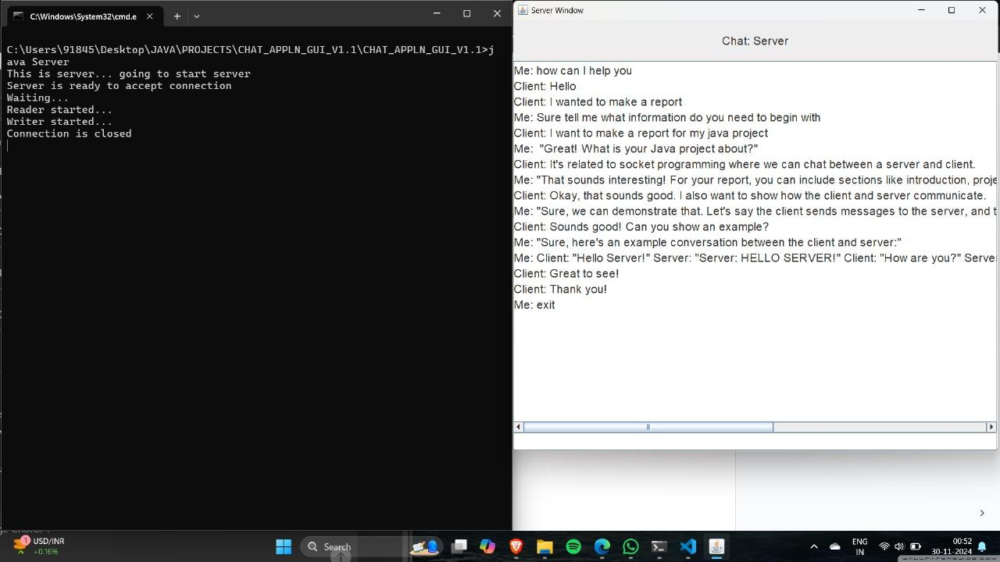
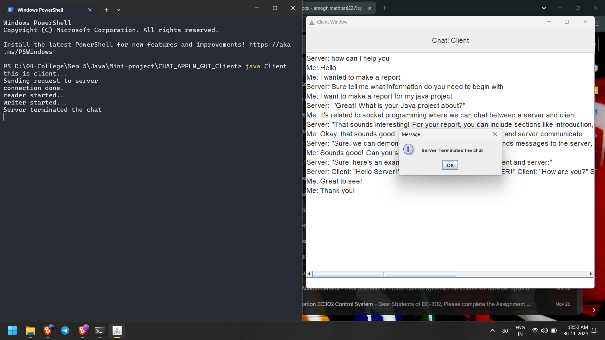

# Socket-chat-gui

About
----------------------------------------------------------------------
Socket programming based chat application made in java using Swing GUI.

Run Client program on one device and Server device on other ensuring both devices are under the same network.

Screenshots
----------------------------------------------------------------------
### Server:

### Client:

